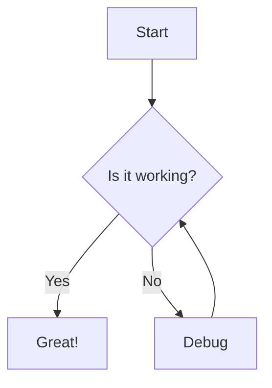

Diagrams are essential tools for visualizing processes, workflows, and data structures. Whether you're planning a software architecture, mapping out a business process, or documenting a complex system, visual representations make information more accessible and easier to understand.

## What is Mermaid?

Mermaid is a JavaScript-based diagramming and charting tool that uses text-based definitions to create and modify diagrams dynamically. It's become increasingly popular because it allows developers and technical writers to create diagrams using simple, markdown-like syntax.

## Why Use Mermaid with ChatGPT?

ChatGPT supports Mermaid syntax natively, which means you can ask it to generate diagrams directly in your conversations. This integration offers several advantages:

- **Speed:** Generate complex diagrams in seconds
- **Iteration:** Easily modify and refine diagrams through conversation
- **Accessibility:** No need for specialized diagramming software
- **Version Control:** Text-based diagrams can be stored in repositories

## Getting Started

To generate a Mermaid diagram in ChatGPT, simply ask for what you need. For example:

> "Create a flowchart showing the user authentication process"

## Common Diagram Types

Mermaid supports various diagram types, including:

- **Flowcharts:** Perfect for process flows and decision trees
- **Sequence Diagrams:** Ideal for showing interactions between components
- **Class Diagrams:** Great for object-oriented design
- **Gantt Charts:** Useful for project timelines
- **State Diagrams:** Excellent for state machines and workflows

## Quick Example

Here's a simple example of Mermaid syntax for a flowchart:

## Best Practices

- Start with clear requirements for your diagram
- Iterate and refine based on the initial output
- Keep diagrams focused and not overly complex
- Use consistent naming conventions
- Save the Mermaid code for future use

## Conclusion

Mermaid diagrams in ChatGPT provide a powerful, accessible way to create professional visualizations quickly. Whether you're documenting architecture, planning workflows, or communicating complex ideas, this combination offers an efficient solution that fits seamlessly into modern development workflows.
